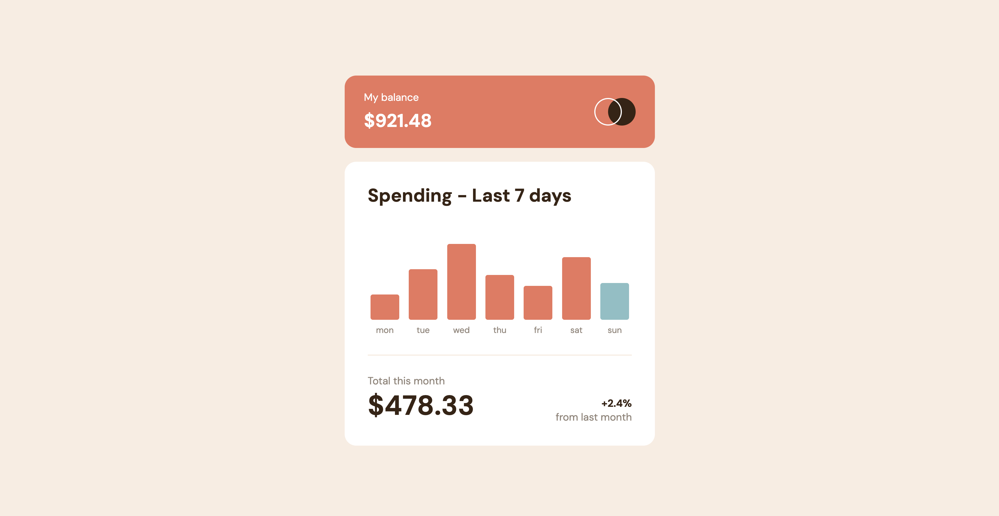

# Expenses Chart Component

## Table of contents

- [Overview](#overview)
  - [Screenshot](#screenshot)
  - [Links](#links)
- [My process](#my-process)
  - [Built with](#built-with)
- [Author](#author)

## Overview

### Screenshot

### Links

- Solution URL: [Solution URL](https://github.com/kisu-seo/expenses_chart_component)
- Live Site URL: [Live URL](https://kisu-seo.github.io/expenses_chart_component/)

## My process

### Built with

- **Semantic HTML5 Markup** - Structuring the component with `<main>`, `<header>`, `<section>`, and `<h1>` to create a meaningful and accessible document hierarchy optimized for screen reader landmark navigation.
- **CSS Custom Properties (Design Tokens)** - Centralizing all design tokens (colors, typography presets, spacing scale, layout values) in `:root` as a single source of truth. Notably, `--bar-max-height` is shared between CSS and JavaScript at runtime via `getComputedStyle()`, ensuring the two files stay in sync without duplication.
- **BEM Methodology** - Implementing the Block-Element-Modifier naming convention throughout for a clear, scalable class architecture (e.g., `.chart__bar`, `.chart__bar--today`, `.balance-card__label`, `.summary__comparison-label`).
- **Flexbox Layout** - Managing chart bar alignment with `align-items: flex-end` so bars of different heights all share a common bottom baseline. The three-level Flexbox hierarchy (`.chart` → `.chart__bar-wrapper` → bar/label) is the core structural pattern.
- **Mobile-First Workflow** - Writing base styles targeting mobile (375px) and progressively overriding layout, typography, and sizing through Tablet (768px) and Desktop (1024px) breakpoints.
- **Google Fonts (DM Sans)** - Integrating 'DM Sans' (400 Regular, 700 Bold) as specified in `style-guide.md`, loaded with `preconnect` for reduced connection latency.
- **Vanilla JavaScript & Fetch API** - Dynamically rendering the bar chart by fetching `data.json` and programmatically creating and injecting DOM elements (`chart__bar-wrapper`, `chart__bar`, `chart__tooltip`, `chart__day`) without any external libraries.
- **Proportional Bar Height Calculation** - Computing each bar's height in pixels using the formula `(amount / maxAmount) × availableHeight`, where `availableHeight` is derived by subtracting the day-label space (24px mobile / 28px tablet) from `--bar-max-height`. This ensures the tallest bar always fills the chart area regardless of the dataset.
- **Fetch Fallback Strategy** - Wrapping `fetch()` in a `try...catch` block to gracefully handle `file://` protocol CORS restrictions. When `fetch()` fails, `FALLBACK_DATA` (hardcoded inline) is passed to `renderChart()`, guaranteeing a fully rendered chart even without a local server.
- **`Date` Object for Today Highlighting** - Detecting the current day of the week via `new Date().getDay()` and mapping it to `data.json`'s day string format to automatically apply the `.chart__bar--today` modifier class (blue-300 highlight color).
- **Accessibility (a11y)** - Applying `role="img"` and `aria-label` (e.g., `"wed 지출: $52.36"`) exclusively to each `.chart__bar` so screen readers announce day and amount in one unit. Decorative elements (`.chart__tooltip`, `.chart__day`, logo ``) are suppressed with `aria-hidden="true"` to prevent duplicate announcements.
- **Desktop-only Hover & Tooltip States** - Restricting all `:hover` and tooltip (`display: block`) interactions to `@media (min-width: 1024px)` to prevent the 'sticky hover' UX bug on touch-based devices.

## Author

- Website - [Kisu Seo](https://github.com/kisu-seo)
- Frontend Mentor - [@kisu-seo](https://www.frontendmentor.io/profile/kisu-seo)
